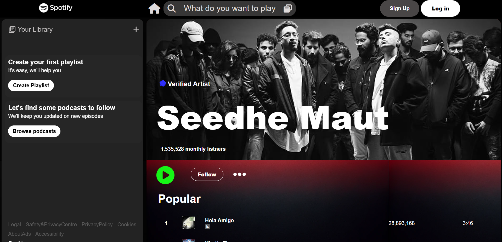
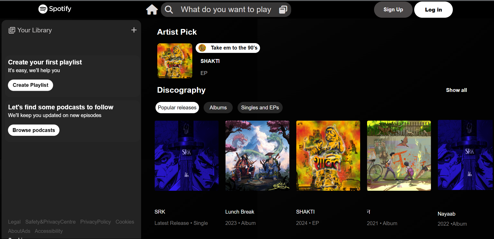
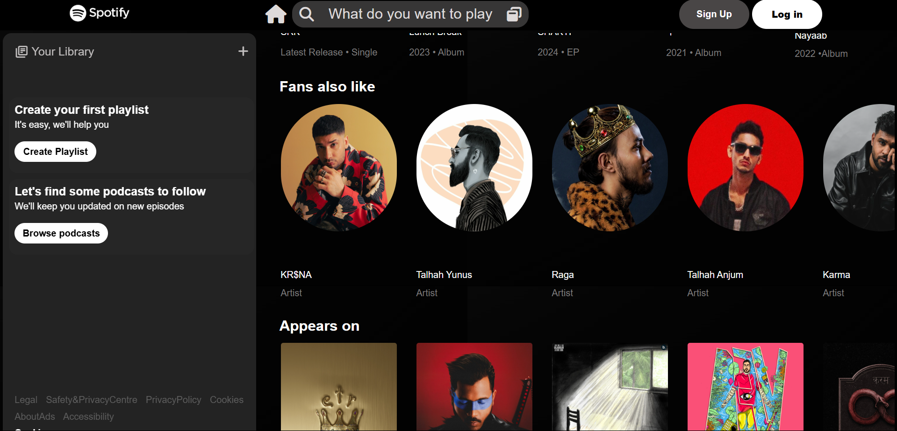
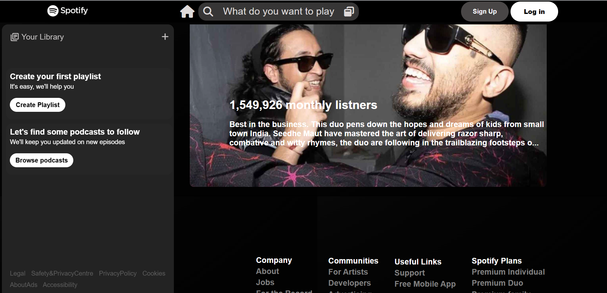

# 🎵 Spotify Clone Project

A pixel-perfect Spotify clone built with HTML, CSS, and Bootstrap, showcasing modern web development practices.

## ✨ Features

- 🎨 Pixel-perfect UI matching Spotify's design.
- 📱 Fully responsive layout.
- 🎵 Interactive music player interface.
- 📂 Dynamic playlist display.
- 🌙 Dark theme design
- 📊 Custom grid system using Bootstrap

## 🚀 Tech Stack

- **HTML5** - Semantic markup structure
- **CSS3** - Custom styling and animations
- **Bootstrap 5** - Responsive grid and components
- **Font Awesome** - For music and UI icons

## 📸 Screenshots

<div align="center">
  
  <p><em>Home Screen with Featured Playlists</em></p>

  
  <p><em>Playlist View with Song List</em></p>

  
  <p><em>Artist Page Design</em></p>
  
  
  <p><em>Footer and About Section Design</em></p>
</div>

## 🛠️ Project Structure

```
spotify-clone/
│
├── index.html
├── css/
│   ├── style.css
│   └── responsive.css
├── assets/
│   ├── images/
│   └── icons/
└── screenshots/
```

## 🌟 Getting Started

1. Clone the repository:
```bash
git clone https://github.com/yourusername/spotify-clone.git
```

2. Open `index.html` in your browser to view the project.

3. To make changes:
   - Edit `index.html` for structure
   - Modify `css/style.css` for styling
   - Adjust `css/responsive.css` for responsive design

## ✨ Key Features Implemented

- Responsive navigation bar
- Dynamic playlist grid
- Custom music player controls
- Hover effects and animations
- Mobile-first approach
- Bootstrap grid system utilization

## 🎯 Learning Outcomes

- Advanced HTML5 semantic structure
- CSS3 modern properties and flexbox
- Bootstrap framework implementation
- Responsive design principles
- Web design best practices

## 🤝 Contributing

Contributions are welcome! Here's how you can help:

1. Fork the project
2. Create your feature branch (`git checkout -b feature/AmazingFeature`)
3. Commit your changes (`git commit -m 'Add some AmazingFeature'`)
4. Push to the branch (`git push origin feature/AmazingFeature`)
5. Open a Pull Request

## 📝 License

This project is licensed under the MIT License - see the [LICENSE](LICENSE) file for details.

## 🙏 Acknowledgments

- Spotify's design team for inspiration
- Bootstrap team for their amazing framework
- Font Awesome for the icons
- All contributors and feedback providers

## 📬 Contact

Himanshu Dusane - [LinkedIn](https://www.linkedin.com/in/himanshu-dusane-5a8ab6274/)

Social - [Instagram](https://www.instagram.com/_.himanxhu_.1/)

---

⭐️ If you found this project helpful, please give it a star!
